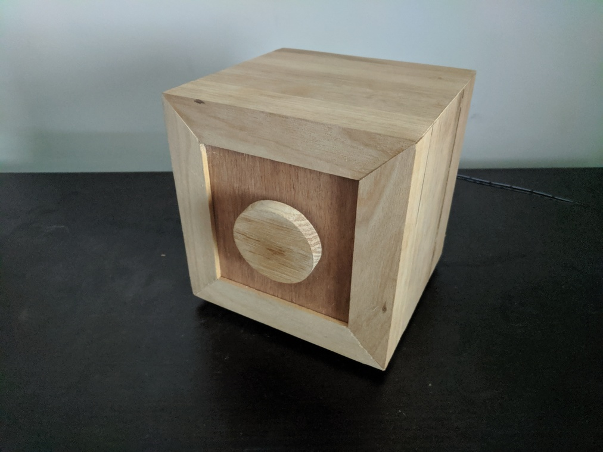
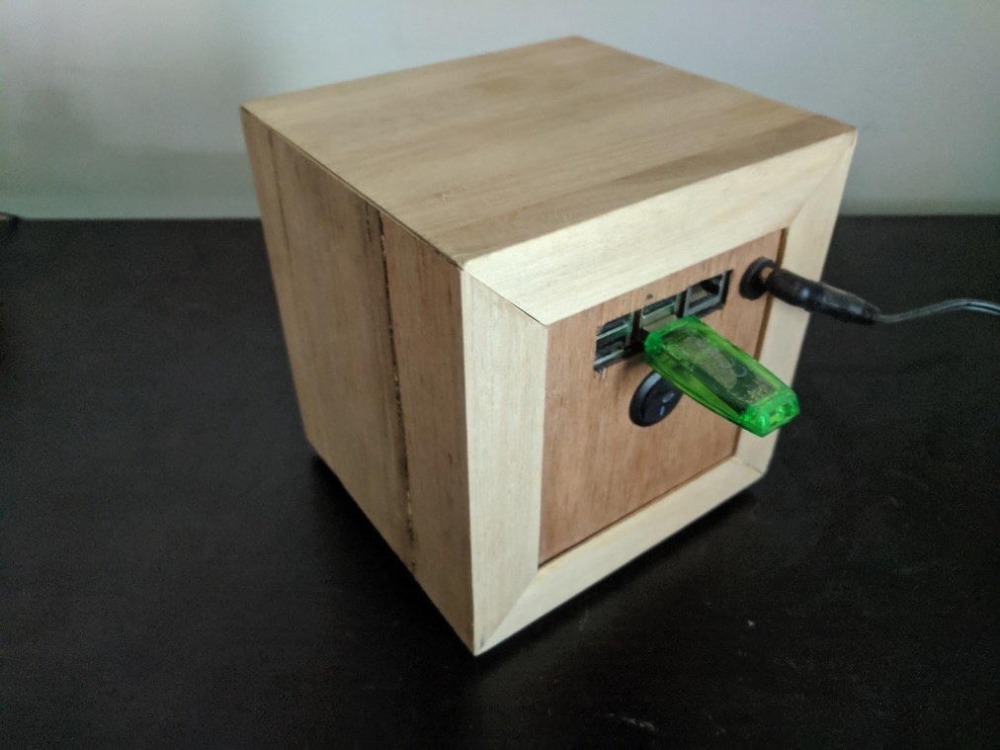
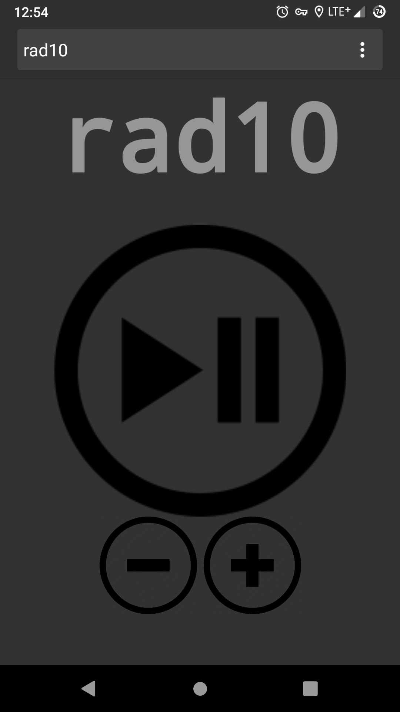
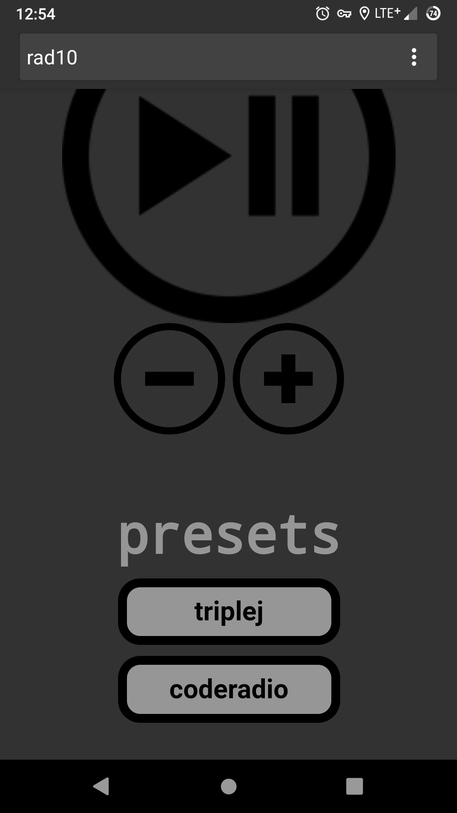

# rad10d
A daemon written for an internet radio project using a raspberry pi.  The daemon interfaces with the mpd client api to allow volume and play/pause toggle control via a rotary encoder with push-button.  Roatating the encoder adjusts the volume, the push-button toggles play/pause.  Simple!  

My hardware implementation includes a Raspberry Pi 3 with a small amplifier board connected to the 3.5mm audio jack.  The amplifier is set up with a mono output to a single speaker.  

The rotary encoder channels A and B are connected to the Pi's GPIO pins 14 and 15 (Broadcom numbering) respectively (physical pins 8 & 10).  

The push-button is connected to GPIO pin 18 (Broadcom numbering) (physical pin 12).  

## Setup instructions
Install the dependencies.
```shell
$ sudo apt update
$ sudo apt install pigpio mpd mpc libmpdclient-dev
```
Notes:
* Instead of using the package manager to install the mpdclient library (libmpdclient-dev), you can obtain it directly from the [libmpdclient download page](https://musicpd.org/libs/libmpdclient/).
* You don't neccessarily need to install mpc for this project, but it's a great tool for controlling mpd from the command line and also useful for debugging.  It is required however if you wish to use the WebUI.

Clone this repo and compile the executable "rad10d":
```shell
$ git clone https://gitlab.com/clewsy/rad10d
$ cd rad10d
$ make all
```
Copy files to system directories:
```shell
$ sudo cp rad10d /usr/local/sbin/rad10d
$ sudo cp rad10d.service /lib/systemd/system/rad10d.service
```
Enable and start the service:  
(This service is created so that the daemon runs at boot).
```shell
$ sudo systemctl enable rad10d.service
$ sudo systemctl start rad10d.service
```

## WebUI
Although not required for the hardware functionality enabled by following the instructions above, this repository also includes a simple web-based user interface (WebUI) for similar control of mpd on the raspberry pi.  

The interface is written in php/html/css and just gives a play/pause toggle button and volume up/down control.  

It also includes a couple of "presets" that I typically use.  

To install the WebUI, the raspberry pi will require installation of php and web server software such as [Apache](https://httpd.apache.org/), [NGinX](https://nginx.org/), [Lighttpd](https://www.lighttpd.net/) or similar.  The following instructions will use Apache.

```shell
$ sudo apt update
$ sudo apt install apache2 php
```
By default, Apache will serve the html/css/php files stored at the /var/www/html directory.

From within this directory, delete any existing files then copy the webui files from the previously cloned repository:

```shell
$ cd /var/www/html
$ sudo rm -r *
$ sudo cp --recursive ~/rad10/webui/* .		## Change to suit wherever you cloned the rad10 repository. 
```
The web interface should now be available over your local network.  If the hostname of your raspberry pi remains as the default, then the p0wer WebUI should be accessible from your browser at http://raspberrypi/

## Credits
Guidance for developing the rotary encoder interface came from the work done by Andrew Stine.  
https://github.com/astine/rotaryencoder/blob/master/rotaryencoder.c

Daemon uses the MPD client c library.  
https://www.musicpd.org/doc/libmpdclient/index.html

~~Hardware interfacing with the Raspberry Pi uses the WiringPi library by Drogon (Gordon Henderson).~~  
~~http://wiringpi.com/~~

As of August 2019, the wiringPi library has been deprecated so I transitioned to the pigpio library.  
http://abyz.me.uk/rpi/pigpio/index.html

## Photos
Here's my internet rad10!





Some screenshots of the WebUI on an android smartphone:



